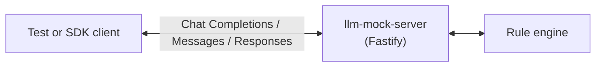
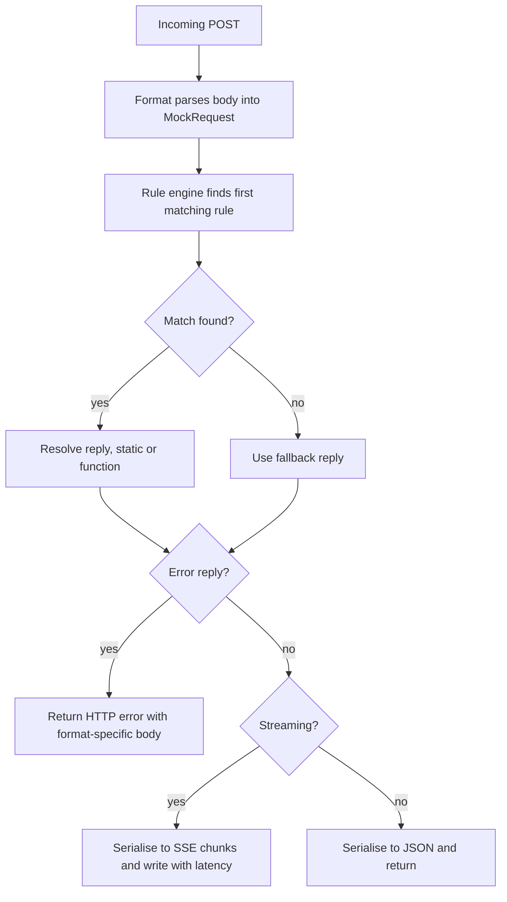

# llm-mock-server architecture

A mock LLM server built on Fastify. Clients send requests in OpenAI Chat Completions, Anthropic Messages, or OpenAI Responses API format. The server normalises them into a common shape, matches against registered rules, and sends back responses in the right format.

## Table of contents

- [Startup](#startup)
- [Format system](#format-system)
- [Request lifecycle](#request-lifecycle)
- [Rule engine](#rule-engine)
- [Types](#types)
- [Streaming](#streaming)
- [File loading](#file-loading)
- [Logging](#logging)
- [Security model](#security-model)

## Startup

[`cli.ts`](src/cli/cli.ts) is the CLI entry point. It parses flags with Commander, validates them through [`validators.ts`](src/cli/validators.ts), creates a `MockServer`, loads any rule files, and handles SIGINT/SIGTERM. With `--watch`, it sets up `fs.watch()` on the rules path and reloads on changes.

[`MockServer`](src/mock-server.ts) is the main class. The constructor creates a Fastify instance and registers a route handler for each format. Rule authoring (`when()`, `whenTool()`, `whenToolResult()`, `nextError()`) lives in [`RuleBuilder`](src/rule-builder.ts) and is proxied onto `MockServer` via `.bind()`. Consumers interact with it through the rule methods, `fallback()`, `load()`, and the lifecycle methods.

[`createMock()`](src/index.ts) is a convenience that creates a server and starts it in one call.

## Format system

A format is anything that satisfies the [`Format`](src/formats/types.ts) interface. It needs to be able to parse requests, serialise streaming and non-streaming responses, and produce error bodies.

Three formats are included:

| Format | Route | Directory |
| ------ | ----- | --------- |
| OpenAI Chat Completions | `POST /v1/chat/completions` | [`formats/openai/chat-completions/`](src/formats/openai/chat-completions/) |
| Anthropic Messages | `POST /v1/messages` | [`formats/anthropic/`](src/formats/anthropic/) |
| OpenAI Responses | `POST /v1/responses` | [`formats/openai/responses/`](src/formats/openai/responses/) |

Each format directory has three files:

- `parse.ts` takes the incoming request body (plus HTTP headers and path) and turns it into a normalised [`MockRequest`](src/types/request.ts)
- `serialize.ts` takes a [`ReplyObject`](src/types/reply.ts) and produces SSE chunks or a JSON response
- `index.ts` wires parse and serialize together into a `Format` object

Shared helpers are split into request and response files: [`request-helpers.ts`](src/formats/request-helpers.ts) has `buildMockRequest()` and `isStreaming()` (used by parsers), and [`serialize-helpers.ts`](src/formats/serialize-helpers.ts) has `genId()`, `splitText()`, `shouldEmitText()`, and `finishReason()` (used by serialisers).

To add a new format (say, Gemini), you would create a new directory with those three files and add it to the `formats` array in `mock-server.ts`. Everything else (rule matching, streaming, logging, history) works automatically.

## Request lifecycle

The route handler logic lives in [`route-handler.ts`](src/route-handler.ts). It is generic over the format and gets its dependencies (engine, history, logger, options) through a `RouteHandlerDeps` object.

## Rule engine

[`RuleEngine`](src/rule-engine.ts) holds rules in an array and evaluates them in order. The first match wins.

Each rule has a compiled matcher function, a resolver (either a static value or a function), and an optional `remaining` counter for `.times()`. When a rule's counter hits zero it gets removed from the list.

`moveToFront()` is what powers the `.first()` API. Rules that call `.first()` get moved to index 0.

The matching itself goes through [`compileMatcher()`](src/rule-engine.ts), which turns a `Match` (string, regex, object, or function) into a predicate. Object matchers check each specified field with AND logic. An optional `predicate` field on `MatchObject` runs last, after all structured fields have passed, so you can combine declarative matching with custom logic.

## Types

Types are split across three files in [`src/types/`](src/types/):

- [`request.ts`](src/types/request.ts) has `MockRequest`, `Message`, `ToolDef`, and `FormatName`
- [`reply.ts`](src/types/reply.ts) has `Reply`, `ReplyObject`, `ErrorReply`, `ToolCall`, `Resolver`, and `ReplyOptions`
- [`rule.ts`](src/types/rule.ts) has `Match`, `MatchObject`, `PendingRule`, `RuleHandle`, `RuleSummary`, `Handler`, and `Rule`

[`src/types.ts`](src/types.ts) re-exports everything as a barrel for the public API. Internal modules import directly from the leaf files.

## Streaming

[`writeSSE()`](src/sse-writer.ts) writes an array of `SSEChunk` objects to the raw HTTP response as server-sent events. It adds a delay between chunks if latency is configured.

Each format's `serialize()` builds the chunk array. Text gets split by `chunkSize` when it's set. The Responses format also assigns incrementing `sequence_number` values to every event using a closure-based counter.

## File loading

[`loadRulesFromPath()`](src/loader.ts) loads rules from disk. It takes a `LoadContext` with the rule engine and an optional fallback setter. A `Map` dispatches by file extension:

- `.json5` and `.json` files get parsed with Zod validation. Files can be a bare array of rules or an object with optional `templates`, `fallback`, and `rules` fields. Template references (`$name`) are resolved at load time. Rules can use `reply` for a single response or `replies` for a sequence
- `.ts`, `.js`, and `.mjs` files get dynamically imported. The default export (a `Handler` or array) is registered. A named `fallback` export sets the server fallback

Directories are read and processed in sorted order.

## Logging

[`Logger`](src/logger.ts) is a threshold-based logger. Each level has a numeric priority and messages below the threshold are dropped. Output is timestamped and coloured with picocolors.

## Security model

The threat model is simple: the server runs locally or in CI, loading files written by the developer. There is no multi-tenant isolation or sandboxing.

Handler files (`.ts`, `.js`, `.mjs`) are loaded via `import()` and execute with full process permissions. The trust boundary is the file system path passed to `load()` or `--rules`. If an attacker can write to that path, they already have code execution on the machine. No path restriction is enforced because legitimate setups often load rules from outside the project directory.

JSON5 files go through Zod validation and never execute code. The only dynamic construction is `new RegExp()` for regex patterns in rule files, which could hang on pathological backtracking patterns but poses no injection risk.

Fastify caps request bodies at 1 MB by default. The server binds to `127.0.0.1` unless explicitly configured otherwise. Responses are serialised through JSON, so reply text cannot break out of SSE framing.

CLI inputs (port, host, latency, log level) are validated through [`validators.ts`](src/cli/validators.ts) before use.
